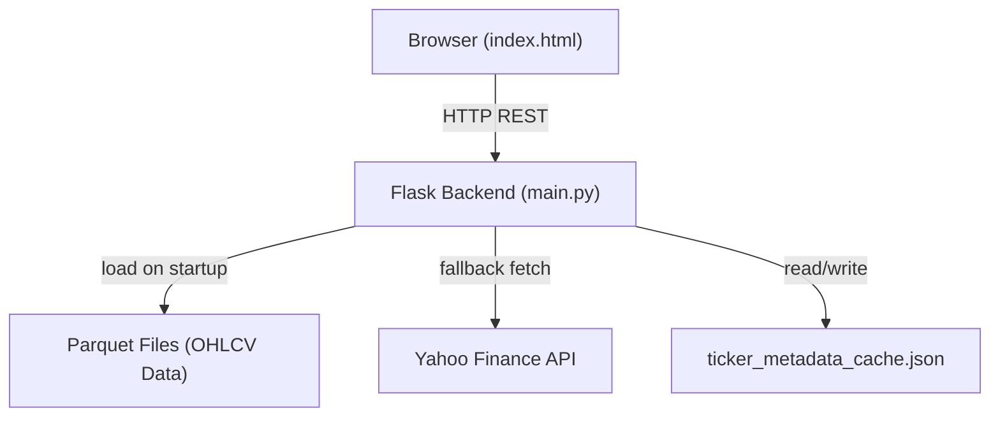
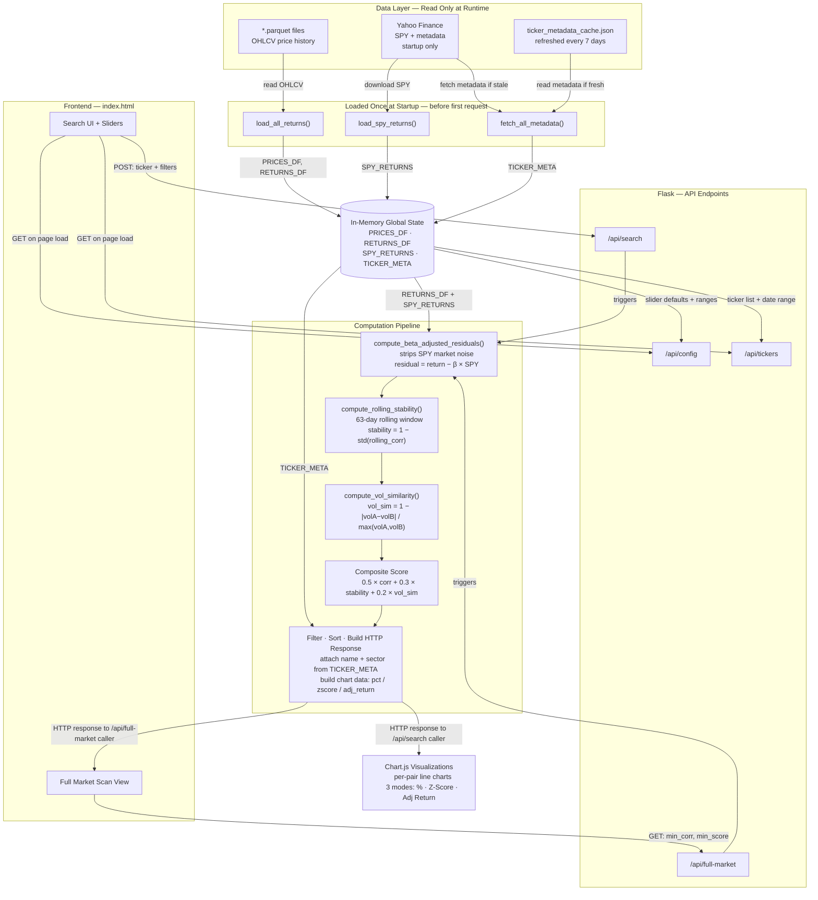
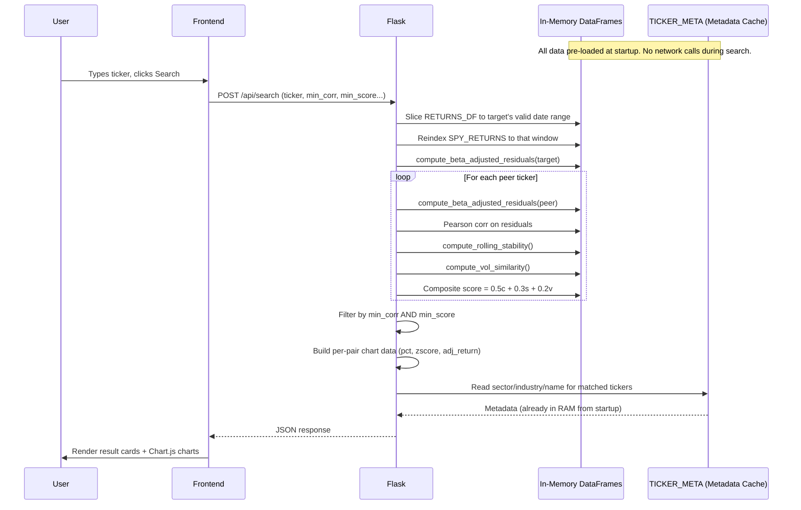
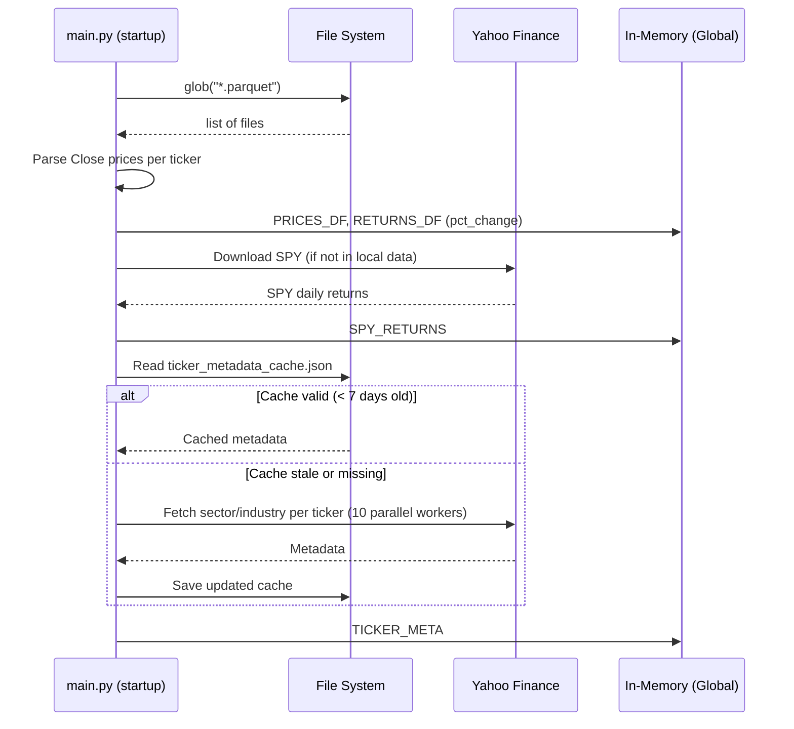
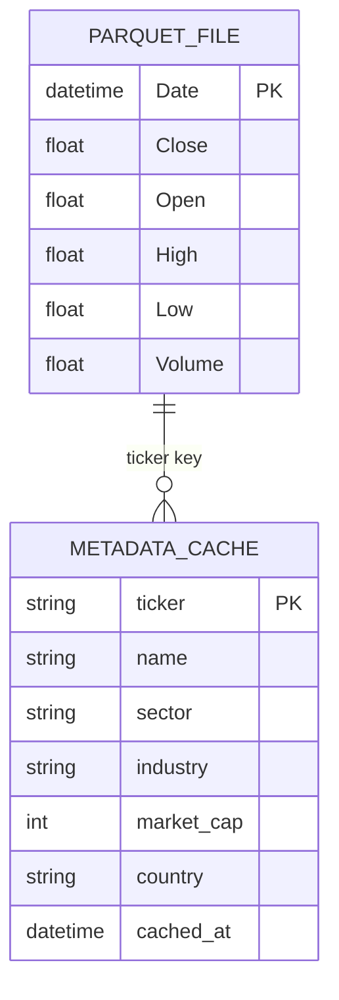

# TickerSync — Ticker Similarity Engine

A quantitative stock correlation engine that finds behaviorally similar tickers using beta-adjusted returns, rolling stability scoring, and volatility matching.

---

## Introduction

This project is designed to:

- **Solve:** Finding stocks that genuinely move together — not just because they both follow the market, but because they share real idiosyncratic behavior.
- **Target:** Quantitative traders, researchers, and portfolio managers who need correlation-based peer discovery across large ticker universes.
- **Approach:** Strip SPY market noise (beta adjustment), compute residual Pearson correlation, measure rolling stability over time, and weight results using a composite score. Results are served via a Flask REST API consumed by a vanilla HTML/JS dashboard.

---

## Tech Stack

| Layer | Technology | Why This Choice |
|---|---|---|
| Backend | Flask (Python) | Minimal, explicit — ideal for small APIs. FastAPI adds async overhead not needed here; Django is too heavy. |
| Frontend | Vanilla HTML + JS + Chart.js | No build step, no framework. Chart.js for rendering; Inter + JetBrains Mono fonts for professional UI. |
| Data Format | Parquet files | Columnar storage — fast for reading a single column (Close price) across large date ranges. |
| Market Data | yfinance (fallback) | Zero-cost SPY benchmark fetching when not in local data folder. |
| Concurrency | ThreadPoolExecutor | Parallelizes Yahoo Finance metadata calls (10 workers) — network-bound, not CPU-bound, so threads beat processes here. |

---
## Configuration
 
There is no `.env` file in this project. The only configuration needed is the path to your local OHLCV data folder, set directly in `main.py`:
 
```python
# main.py — edit this before running
DATA_FOLDER = r"C:\path\to\your\ohlcv_data"
```
 
Change this path to point to your folder of `.parquet` files. Each file must be named after its ticker symbol (e.g., `AAPL.parquet`, `MSFT.parquet`) and must contain at minimum a `Date` column and a `Close` column.

---

## System Architecture

### High-Level



### Detailed Architecture



### Data Flow — Search Request



### Startup Data Loading Flow



---

## Backend API Documentation

### `GET /api/tickers`

**Purpose:** Returns the full list of loaded tickers and the available date range.

**Internal Flow:**
1. Check if `RETURNS_DF` is empty (data not loaded).
2. Return sorted list of column names (ticker symbols).
3. Return date range from `PRICES_DF` index.

**Response:**
```json
{
  "tickers": ["AAPL", "MSFT", "TSLA"],
  "count": 160,
  "date_range": {
    "start": "2010-01-04",
    "end": "2024-12-31"
  }
}
```

---

### `GET /api/config`

**Purpose:** Returns all default slider values and their valid min/max/step ranges. The frontend reads this on startup to initialize all UI controls dynamically — no hardcoded values on the frontend side.

**Response:**
```json
{
  "defaults": {
    "min_correlation": 0.60,
    "min_overlap": 100,
    "lookback_days": null,
    "min_score": 0.65
  },
  "slider_ranges": {
    "min_correlation": { "min": 0.3, "max": 0.99, "step": 0.01 },
    "min_overlap":     { "min": 30,  "max": 500,  "step": 10 },
    "min_score":       { "min": 0.40,"max": 0.90, "step": 0.01 }
  }
}
```

---

### `POST /api/search`

**Purpose:** Core search endpoint. Given a target ticker and filter parameters, returns all correlated peers with composite scores and per-pair chart data.

**Request Body:**
```json
{
  "ticker": "AAPL",
  "min_correlation": 0.65,
  "min_overlap": 100,
  "lookback_days": 500,
  "min_score": 0.65
}
```

**Internal Flow:**
1. Validate ticker exists in `RETURNS_DF`.
2. Slice returns to target's own valid date range.
3. Apply `lookback_days` trim if provided.
4. Compute SPY residuals for the target ticker **once** (not per peer — key performance optimization).
5. For each peer ticker:
   - Compute pairwise valid overlap mask.
   - Skip if overlap days < `min_overlap`.
   - Compute raw Pearson correlation.
   - Compute beta-adjusted residual correlation (falls back to raw if SPY unavailable).
   - Compute rolling 63-day stability score.
   - Compute volatility similarity score.
   - Composite score = `0.5 × adj_corr + 0.3 × stability + 0.2 × vol_sim`.
6. Filter: must pass **both** `min_corr` and `min_score`.
7. Build chart data for each matched pair in three modes: `pct` (% return), `zscore`, `adj_return` (beta-stripped cumulative alpha).
8. Return full JSON payload.

**Response:**
```json
{
  "target": "AAPL",
  "target_name": "Apple Inc.",
  "target_sector": "Technology",
  "trading_days": 3500,
  "results": [
    {
      "ticker": "MSFT",
      "score": 0.78,
      "score_label": "strong",
      "correlation": 0.82,
      "raw_correlation": 0.87,
      "beta_gap": 0.05,
      "stability": 0.74,
      "vol_similarity": 0.91,
      "volatility": 22.4,
      "overlap_days": 3498,
      "sector": "Technology",
      "cross_sector": false
    }
  ],
  "chart_data_by_ticker": {
    "MSFT": {
      "pct": [{ "date": "2020-01-02", "AAPL": 0.0, "MSFT": 0.0 }],
      "zscore": [...],
      "adj_return": [...]
    }
  },
  "beta_adjustment": true,
  "suggested_min_corr": 0.70,
  "cross_sector_count": 3
}
```

---

### `GET /api/full-market`

**Purpose:** Scans ALL ticker pairs simultaneously using vectorized matrix operations. Returns a grouped map of every ticker → its correlated peers above threshold.

**Query Parameters:**

| Parameter | Type | Default | Description |
|---|---|---|---|
| `min_correlation` | float | 0.60 | Minimum adjusted correlation |
| `min_score` | float | 0.65 | Minimum composite score |
| `min_overlap` | int | 100 | Minimum shared trading days |
| `lookback_days` | int | None | Limit history window |

**Internal Flow:**
1. Trim `RETURNS_DF` to `lookback_days` window.
2. Beta-adjust all tickers at once (one residual per ticker).
3. Compute full N×N correlation matrix via `pandas .corr()` 
4. Compute annualized volatility per ticker (vectorized).
5. For pairs passing `min_corr`: compute rolling stability + vol similarity + composite score.
6. Filter by `min_score`. Sort by `best_score` descending.

**Response:**
```json
{
  "tickers_scanned": 160,
  "tickers_with_peers": 143,
  "total_pairs": 1842,
  "beta_adjustment": true,
  "results": {
    "AAPL": {
      "ticker": "AAPL",
      "name": "Apple Inc.",
      "sector": "Technology",
      "peers": [
        { "ticker": "MSFT", "score": 0.78, "adj_corr": 0.82 }
      ],
      "peer_count": 12,
      "best_score": 0.78
    }
  }
}
```

---

## Backend Architecture (Code-Level)

### File Structure

```
backend/
│
├── main.py              # Entire Flask application
│   ├── Configuration    # DATA_FOLDER, DEFAULTS, SLIDER_RANGES
│   ├── Data Loading     # load_all_returns(), load_spy_returns()
│   ├── Metadata         # fetch_all_metadata(), cache read/write
│   ├── Helper Functions # Beta adjustment, stability, vol_sim, scoring
│   └── API Endpoints    # /api/tickers, /api/config, /api/search, /api/full-market
│
├── ticker_metadata_cache.json  # Auto-generated, refreshed every 7 days
└── templates/
    └── index.html       # Frontend (served by Flask render_template)
```

### Global State (Loaded Once at Startup)

| Variable | Type | Description |
|---|---|---|
| `PRICES_DF` | `pd.DataFrame` | Close prices, one column per ticker, DatetimeIndex rows |
| `RETURNS_DF` | `pd.DataFrame` | Daily % returns (pct_change), same shape |
| `SPY_RETURNS` | `pd.Series` | SPY daily returns aligned to RETURNS_DF index |
| `TICKER_META` | `dict` | `{ticker: {name, sector, industry, market_cap, country}}` |

**Why load at startup?**
Loading from disk and computing a returns matrix on every request would add 2–10 seconds of latency per search. Keeping it in memory means all searches operate on pre-computed, pre-aligned DataFrames — search latency drops to ~100–500ms.

### Helper Functions

#### `compute_beta_adjusted_residuals(ticker_returns, spy_returns)`

Strips market influence from a ticker's returns:

```
residual(t) = ticker_return(t) - β × spy_return(t)
β = Cov(ticker, SPY) / Var(SPY)
```

**Why residuals?**
Raw correlation tells you "do both follow the market?" Residual correlation tells you "do they share movement **beyond** market noise?" The latter is a far stronger signal of genuine behavioral similarity. Gracefully falls back to raw returns if SPY overlap < 60 days.

#### `compute_rolling_stability(series_a, series_b, window=63)`

Measures consistency of correlation over time using 63-day (≈ 1 quarter) rolling windows:

```
stability = 1.0 - std(rolling_correlation)
```

#### `compute_vol_similarity(vol_a, vol_b)`

```
vol_sim = 1 - |vol_a - vol_b| / max(vol_a, vol_b)
```
#### `classify_score(score)`

| Score Range | Label |
|---|---|
| ≥ 0.75 | `strong` |
| 0.60 – 0.74 | `moderate` |
| < 0.60 | `weak` |

#### `suggest_threshold(trading_days)`

Suggests a realistic `min_correlation` based on how much history exists. More data → more stable estimates → stricter threshold is safe:

| Trading Days | Suggested Threshold |
|---|---|
| < 400 | 0.55 |
| 400 – 749 | 0.60 |
| 750 – 1499 | 0.65 |
| ≥ 1500 | 0.70 |

---

## Frontend Architecture

### How It Works

The frontend is a single `index.html` file (no build step, no framework). On load it:
1. Calls `GET /api/tickers` and `GET /api/config` in parallel to populate the ticker list and initialize sliders.
2. On search, posts to `GET /api/search` and renders result cards + Chart.js charts.
3. Full Market Scan calls `GET /api/full-market` and renders a grouped peer view.

### Key UI Components

| Component | Description |
|---|---|
| Sidebar | Ticker input, filter sliders (correlation, score, overlap, lookback), mode buttons |
| Stats Bar | Total matches, trading days, volatility, cross-sector count, beta adjustment status |
| Validation Cards | Avg score, avg stability, avg vol similarity, top correlation found |
| Charts Grid | Per-pair Chart.js line charts, expandable, mode-switchable (% / Z-Score / Adj Return) |
| Full Market View | Grouped accordion: each ticker → its scored peer list |

### Chart Modes

| Mode | Formula | When to Use |
|---|---|---|
| `pct` | `(price / price_at_overlap_start - 1) × 100` | Seeing real % gain/loss from a shared starting date |
| `zscore` | `(price - mean) / std` over overlap window | Comparing shape independent of scale and level |
| `adj_return` | Cumulative sum of SPY-stripped residuals × 100 | Visualizing alpha movement beyond market noise |

**Why send all three from the backend?**
The toggle between modes is instant — no re-fetch needed. Data size is negligible (~200–800 rows × 2 columns × 3 modes per pair).

### Beta Gap — Interpretation Guide

```
beta_gap = raw_correlation - beta_adjusted_correlation
```

| Beta Gap | Interpretation |
|---|---|
| < 0.05 | Genuine peers — similarity survives market noise removal |
| 0.05 – 0.15 | Mixed — partially genuine, partially market-driven |
| > 0.15 | Market-driven — both just follow SPY |

---

## Composite Score Formula

```
score = 0.5 × adj_correlation
      + 0.3 × rolling_stability
      + 0.2 × vol_similarity
```

**Why these weights?**
- Correlation (50%) is the primary signal but can be noisy.
- Stability (30%) penalizes relationships that only existed in certain market regimes.
- Vol similarity (20%) is a softer signal — useful for filtering extreme outliers.

A ticker with high correlation but low stability scores lower than one with slightly lower correlation that holds consistently across time.

---

## Database Schema

This system uses **flat Parquet files** instead of a relational database.



**Why Parquet instead of a database?**
- Parquet is column-oriented: reading only `Close` from a 10-year file is extremely fast.
- No server to run — files are just files on disk.
- Pandas reads Parquet natively. A SQL database would require an ORM layer, migrations, and a running process.
- The data is read-only at runtime — no transactions, no writes needed.

---

## Setup Instructions

### 1. Clone the Repository

```bash
git clone https://github.com/lalahrukh162/tickersync.git
cd tickersync
```

### 2. Install Dependencies

```bash
pip install flask flask-cors pandas numpy yfinance pyarrow
```

### 3. Configure Data Folder

Edit `main.py` line 38 or set an environment variable:

```bash
# Windows
set DATA_FOLDER=C:\path\to\ohlcv_data

# macOS/Linux
export DATA_FOLDER=/path/to/ohlcv_data
```

Each `.parquet` file in the folder should be named by ticker symbol (e.g., `AAPL.parquet`) and contain at minimum a `Date` column and a `Close` column.

### 4. Run the Server

```bash
python main.py
```

The server starts at `http://localhost:5000`. Open the browser to access the dashboard.

**Server configuration:**

```python
app.run(
    debug=False,    # Never True in shared/production environments
    host="0.0.0.0", # Accessible on local network
    port=5000,
    threaded=True   # One thread per request — prevents one slow scan from blocking all users
)
```

### 5. First-Run Behavior

On first startup, the app will:
1. Load all parquet files from `DATA_FOLDER`.
2. Download SPY from Yahoo Finance if not in local data.
3. Fetch sector/industry metadata for all tickers using 10 parallel workers.
4. Save metadata to `ticker_metadata_cache.json` for future runs.

---

